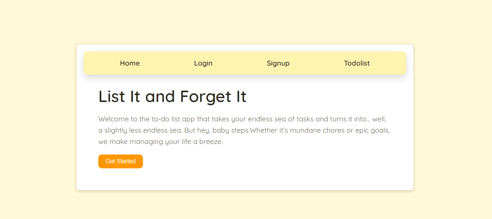
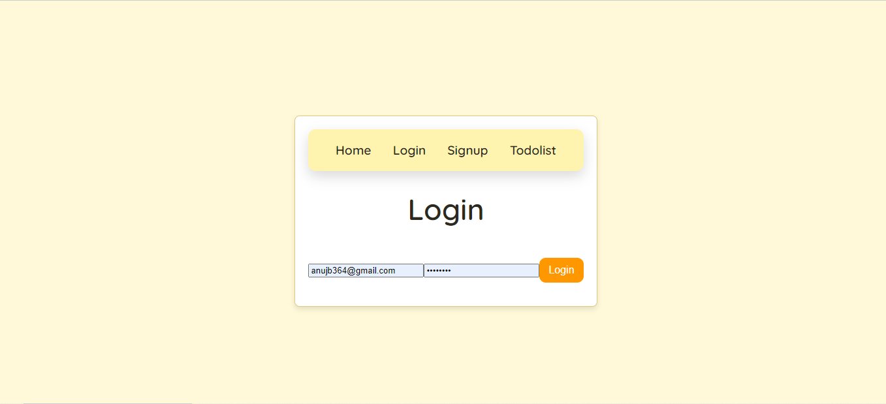
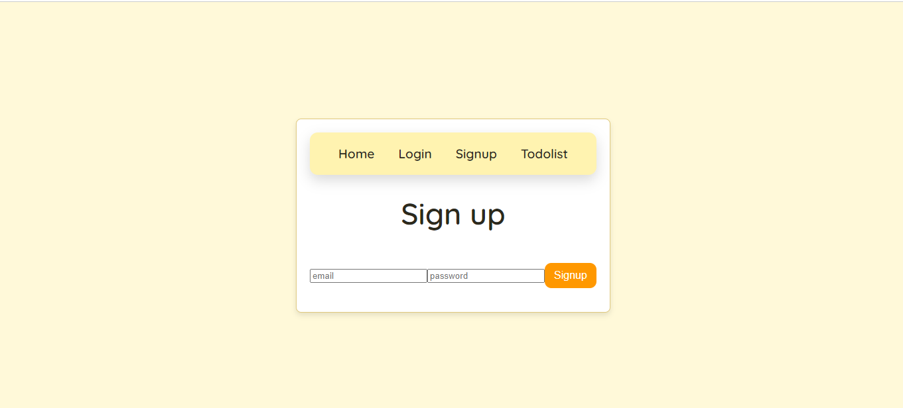
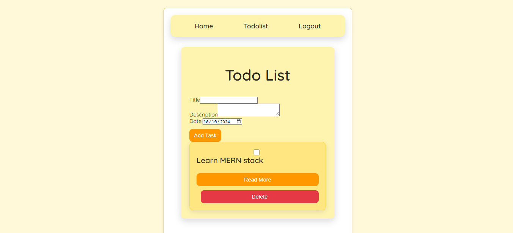

# List It and Forget It

List It and Forget It is a simple to-do list application built using the MERN stack (MongoDB, Express.js, React, Node.js). It allows users to create, update, delete, and mark tasks as complete, providing a straightforward way to manage tasks.

## Features

- **Authentication:** Users can sign up, log in, and log out securely using JWT (JSON Web Tokens).
- **Task Management:** Create new tasks, update existing tasks, delete tasks, and mark tasks as completed.
- **Responsive Design:** The application is designed to be fully responsive, ensuring a seamless experience across devices.
- **Persistent Data:** Tasks are stored in a MongoDB database, ensuring data persistence.
- **Token-based Authentication:** JWT is used for secure authentication, with tokens stored in HTTP-only cookies for improved security.

## Technologies Used

- **Frontend:** React, React Router, Axios
- **Backend:** Node.js, Express.js, MongoDB (mongoose)
- **Authentication:** JWT (JSON Web Tokens), bcryptjs
- **Styling:** CSS (for styling components)

## Usage

- **Signup:** Create a new account with a unique username and password.
- **Login:** Log in to your account securely.
- **Add Task:** Create a new task by entering the task description and pressing enter.
- **Delete Task:** Delete a task by clicking on the delete icon.
- **Mark Task Complete:** Toggle the completion status of a task by clicking on the checkbox.
## Installation

To run this project locally, clone the repository, install dependencies, and start both frontend and backend servers.

1. Clone the repository:


   ```bash
   git clone https://github.com/anuz505/Todolist.git
   cd list-it-and-forget-it
   cd client
   cd Todolist
   npm install
   cd ../server
   npm install

2. Environment Variables
   ```bash
   PORT=5000
   MONGODB_URI=<your-mongodb-uri>
4. Start the frontend and backend servers
      ```bash
      npm run dev

##Screenshots
### Landing Page


### Login Page


### Sign up Page


### Task List

